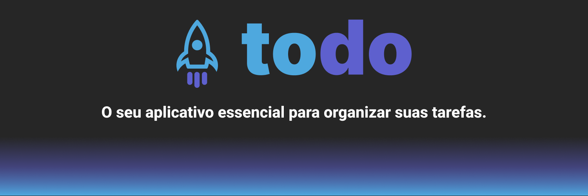

    

  
  
    

 

# App ToDo
> 📝 Seu aplicativo essencial para a organização das suas tarefas.

 
<h2>Conteúdo</h2>

  <a href="#sobre">Sobre</a> •
  <a href="#instalacao">Instalação</a> • 
  <a href="#como-usar">Como usar</a> • 
  <a href="#tecnologias">Tecnologias</a> • 
  <a href="#licenca">Licença</a> • 
  <a href="#autor">Autor</a> • 

 
<h2>Sobre</h2>